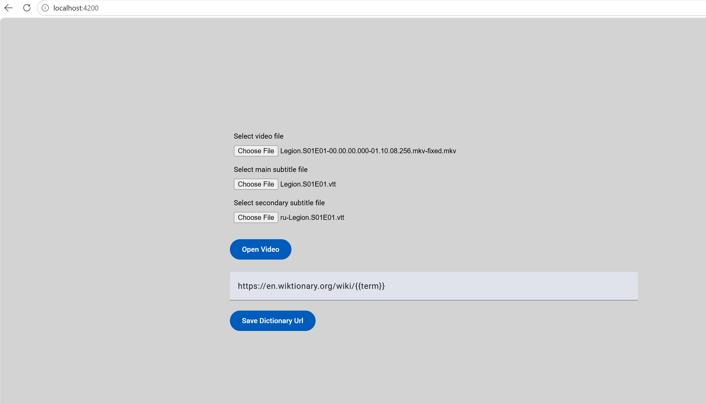
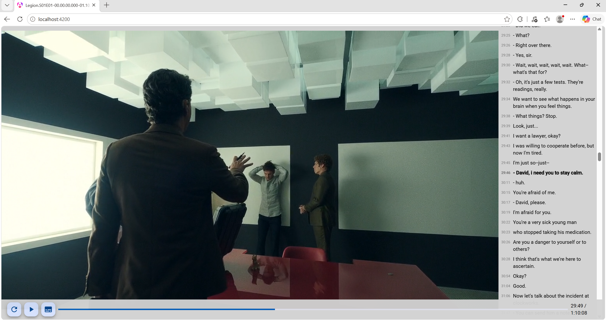

# AFVideoPlayer

[https://andrew2020wit.github.io/af-video-player/](https://andrew2020wit.github.io/af-video-player/)

This is a web-based video player focused on watching movies with subtitles.

This player has its drawbacks and is not intended for mass use.
I wrote it for personal use.

Use of this player by others assumes certain technical skills and a willingness to figure things out.

## Features

1. Subtitles are displayed in a column.
2. Secondary subtitles are displayed as a translation tooltip when hovering over a subtitle.
3. Clicking a word in a subtitle opens an online dictionary for that word in a new tab. You can define your own online dictionary in the settings.
4. Click on the subtitle time to go to that point in the video.
5. Remembers the position of the last watched video (by filename).
6. Hotkeys.

## Screenshots





## Hotkeys

- S - show/hide subtitles
- Space - play/pause (also works by clicking the video)
- ArrowLeft - seek backward
- ArrowRight - seek forward

## Limitations

### Only videos supported by the web browser are supported

You can check browser support by dragging the video file into a new tab - it should play without errors.

Ensure the site has permission to play audio.

The ideal standard for web video, guaranteed to play everywhere with sound, is H.264 video and AAC audio in an MP4 container.

You might need to re-encode your video or audio.

See also the project with some scripts for re-encoding: [af-ffmpeg](https://github.com/andrew2020wit/af-ffmpeg)

### Only the default audio track is supported

Web browsers do not support switching audio tracks for local video files well.
The default audio track will always be played.

You can change the default audio track using scripts or video editors.

See also the project with some scripts for re-encoding: [af-ffmpeg](https://github.com/andrew2020wit/af-ffmpeg)

### Only external subtitles in VTT format

The application displays all subtitles at once, so embedded subtitles are not supported.

Subtitles must be in a separate VTT file.

You can export subtitles from a video file to VTT format using programs like [SubtitleEdit](https://github.com/SubtitleEdit/subtitleedit) or scripts.

See also the project with some scripts: [af-ffmpeg](https://github.com/andrew2020wit/af-ffmpeg)

## Tips

1. On Windows, Microsoft Edge supports more video and audio formats than other browsers.
2. Use the standard browser feature to enter fullscreen mode.

## Some ffmpeg scripts

See also:

[af-ffmpeg](https://github.com/andrew2020wit/af-ffmpeg)

[https://www.ffmpeg.org/](https://www.ffmpeg.org/)

### Video re-encoding

```bash
 ffmpeg -i input.mov -c:v libx264 -profile:v high -level 4.2 -pix_fmt yuv420p -c:a aac -b:a 128k output.mp4
```

### Audio re-encoding only

```bash
ffmpeg -i input.mp4 -c:v copy -c:a aac output.mp4
```

